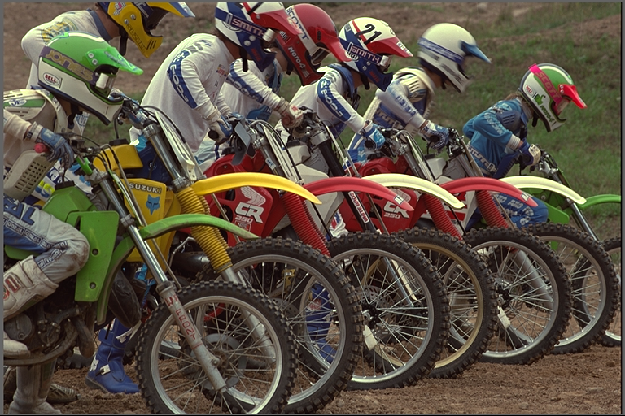
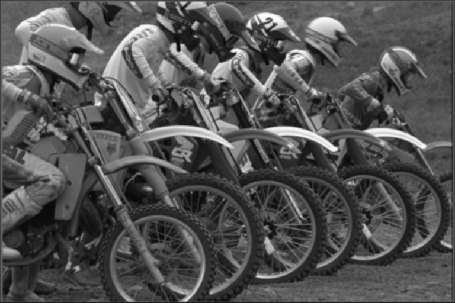
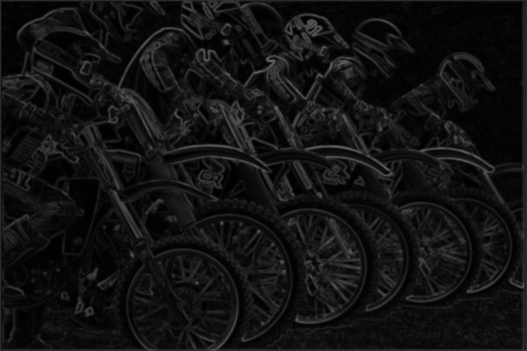
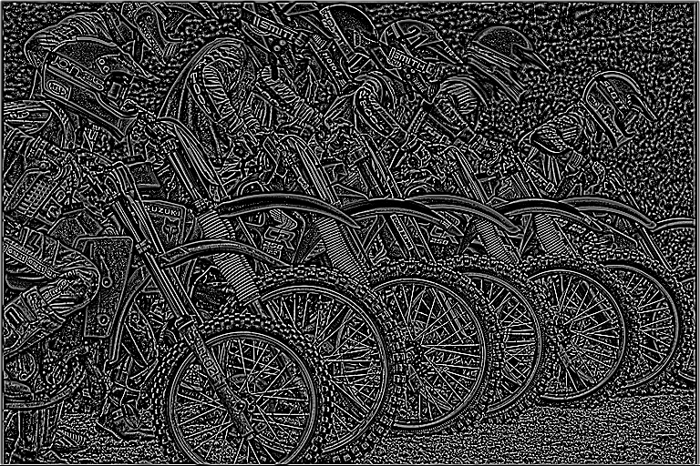
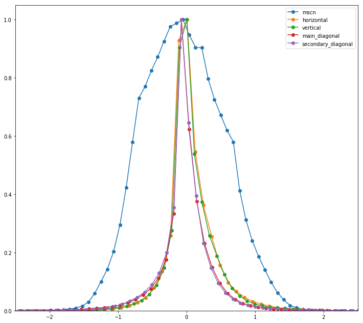

# Blind/referenceless image spatial quality evaluator (BRISQUE)

## Introduction
BRISQUE [4] is a model that only used the image pixels to calculate features (other methods are based on image transformation to other spaces like wavelet or DCT). It is demonstrated to be highly efficient as it does not need any transformation to calculate its features.

It relies on spatial Natural Scene Statistics (NSS) model of locally normalized luminance coefficients in the spatial domain, as well as the model for pairwise products of these coefficients. 

## Methodology
### Natural Scene Statistics in the Spatial Domain
Given an image $I(i, j)$, first, compute the locally normalized luminances $\hat{I}(i,j)$ via local mean subtraction $\mu(i,j)$ and divide it by the local deviation $\sigma(i, j)$. $C$ is added to avoid zero divisions. 

$$\hat{I}(i,j) = \frac{I(i,j) - \mu(i,j)}{\sigma(i,j) + C}$$

*Hint: If $I(i,j)$'s domain is [0,255] then $C=1$ if the domain is [0,1] then $C=1/255$.* 

To calculate the locally normalized luminance, also known as mean substracted contrast normalized (MSCN) coefficients, first, we need to calculate the local mean

$$\mu(i,j) = \sum_{k=-K}^{K}\sum_{l=-L}^{L}w_{k,l}I_{k,l}(i,j)$$

where $w$ is a Gaussian kernel of size $(K, L)$.

The way that the author displays the local mean could be a little bit confusing but it is just applying a Gaussian filter to the image.

Then, we calculate the local deviation

$$ \sigma(i,j) = \sqrt{\sum_{k=-K}^{K}\sum_{l=-L}^{L}w_{k,l}(I_{k,l}(i, j) - \mu(i, j))^2 } $$

Finally, we calculate the MSCN coefficients

$$\hat{I}(i,j) = \frac{I(i,j) - \mu(i,j)}{\sigma(i,j) + C}$$

The author found that the MSCN coefficients are distributed as a Generalized Gaussian Distribution (GGD) for a broader spectrum of distorted image.

$$f(x; \alpha, \sigma^2) = \frac{\alpha}{2\beta\Gamma(1/\alpha)}e^{-\big(\frac{|x|}{\beta}\big)^\alpha}$$

where

$$\beta = \sigma \sqrt{\frac{\Gamma\big(\frac{1}{\alpha}\big)}{\Gamma\big(\frac{3}{\alpha}\big)}}$$

and $\Gamma$ is the gamma function.
The shape $\alpha$ controls the shape and $\sigma^2$ th variance.

### Pairwise products of neighboring MSCN coefficients

The signs of adjacent coefficients also exhibit a regular structure, which gets disturbed in the presence of distortion. The author proposes the model of pairwise products of neighboring MSCN coefficients along four directions (1) horizontal $H$, (2) vertical $V$, (3) main-diagonal $D1$ and (4) secondary-diagonal $D2$.

$$H(i,j) = \hat{I}(i,j) \hat{I}(i, j + 1)$$
$$V(i,j) = \hat{I}(i,j) \hat{I}(i + 1, j)$$
$$D1(i,j) = \hat{I}(i,j) \hat{I}(i + 1, j + 1)$$
$$D2(i,j) = \hat{I}(i,j) \hat{I}(i + 1, j - 1)$$

The author mentions that the Generalized Gaussian Distribution does not provide good fit to the empirical histograms of coefficient producs. Thus, they propose the Asymmetric Generalized Gaussian Distribution (AGGD) model [5].

$$
f(x; \nu, \sigma_l^2, \sigma_r^2) =  
   \begin{cases} 
      \frac{\nu}{(\beta_l + \beta_r)\Gamma\big(\frac{1}{\nu}\big)}e^{\big(-\big(\frac{-x}{\beta_l}\big)^\nu\big)} & x < 0 \\
        \frac{\nu}{(\beta_l + \beta_r)\Gamma\big(\frac{1}{\nu}\big)}e^{\big(-\big(\frac{x}{\beta_r}\big)^\nu\big)} & x >= 0
\end{cases}
$$

where

$$\beta_{side} = \sigma_{side} \sqrt{\frac{\Gamma\big(\frac{1}{\nu}\big)}{\Gamma\big(\frac{3}{\nu}\big)}}$$

and $side$ can be either $r$ or $l$.

Another parameter that is not reflected in the previous formula is the mean

$$\eta = (\beta_r - beta_l) \frac{\Gamma\big(\frac{2}{\nu}\big)}{\Gamma\big(\frac{1}{\nu}\big)}$$

### Fitting Asymmetric Generalized Gaussian Distribution

The methodology to fit an Asymmetric Generalized Gaussian Distribution is described in [5].

1. Calculate $\hat{\gamma}$ where $N_l$ is the number of negative samples and $N_r$ is the number of positive samples. 

$$
\hat{\gamma} = \frac{\sqrt{\frac{1}{N_l - 1}\sum_{k=1, x_k < 0}^{N_l} x_k^2}
}{\sqrt{\frac{1}{N_r - 1}\sum_{k=1, x_k >= 0}^{N_r} x_k^2}
}
$$

2. Calculate $\hat{r}$.

$$\hat{r} = \frac{\big(\frac{\sum|x_k|}{N_l + N_r}\big)^2}{\frac{\sum{x_k ^ 2}}{N_l + N_r}} $$

3. Calculate $\hat{R}$ using $\hat{\gamma}$ and $\hat{r}$ estimations.

$$\hat{R} = \hat{r} \frac{(\hat{\gamma}^3 + 1)(\hat{\gamma} + 1)}{(\hat{\gamma}^2 + 1)^2}$$

4. Estimate $\alpha$ using the approximation of the inverse generalized Gaussian ratio.

$$\hat{\alpha} = \hat{\rho} ^ {-1}(\hat{R})$$

$$\rho(\alpha) = \frac{\Gamma(2 / \alpha) ^ 2}{\Gamma(1 / \alpha) \Gamma(3 / \alpha)}$$

5. Estimate left and right scale parameters.

$$\sigma_l = \sqrt{\frac{1}{N_l - 1}\sum_{k=1, x_k < 0}^{N_l} x_k^2}$$
$$\sigma_r = \sqrt{\frac{1}{N_r - 1}\sum_{k=1, x_k >= 0}^{N_r} x_k^2}$$

### Calculate BRISQUE features

The features needed to calculate the image quality are the result of fitting the MSCN coefficients and shifted products to the Generalized Gaussian Distributions. First, we need to fit the MSCN coefficients to the GDD, then the pairwise products to the AGGD. A summary of the features is the following:

| Feature ID      | Feature Description                            | Computation Procedure            |
|-----------------|------------------------------------------------|----------------------------------|
| $f_1-f_2$       | Shape and variance                             | Fit GGD to MSCN coefficients     |
| $f_3-f_6$       | Shape, mean, left variance, right variance     | Fit AGGD to H pairwise products  |
| $f_7-f_{10}$    | Shape, mean, left variance, right variance     | Fit AGGD to V pairwise products  |
| $f_{11}-f_{14}$ | Shape, mean, left variance, right variance     | Fit AGGD to D1 pairwise products |
| $f_{15}-f_{18}$ | Shape, mean, left variance, right variance     | Fit AGGD to D2 pairwise products |

## Reference
paper: Mittal, A., Moorthy, A. K., & Bovik, A. C. (2012). No-reference image quality assessment in the spatial domain. IEEE Transactions on Image Processing, 21(12), 4695–4708

github: https://github.com/ocampor/notebooks.git